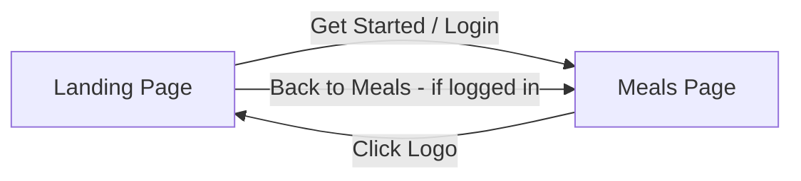

# Add Rotation Branding to Meals Page Header

## Overview
Add the Rotation branding (🍳 emoji + "The Rotation" text) to the top left of the Meals page header (WeekTray component) and enable navigation back to the landing page while keeping the user logged in.

## Current State

### Landing Page Header
Located in [`components/LandingPage.tsx`](components/LandingPage.tsx:38-74):
- Has branding with 🍳 emoji and "The Rotation" text
- Fixed navigation bar with backdrop blur
- Shows "Get Started" and "Guest Mode" buttons

### Meals Page Header
Located in [`components/WeekTray.tsx`](components/WeekTray.tsx:148-287):
- Sticky header showing day circles for week planning
- Action buttons on the right (Shop, Settings, Theme toggle, etc.)
- **No branding/logo** on the left side

## Implementation Plan

### 1. Modify WeekTray.tsx - Add Branding

Add branding element to the left side of the header, before the day circles:

```tsx
// Add onLogoClick prop to interface
interface WeekTrayProps {
  // ... existing props
  onLogoClick?: () => void;
}

// In the component, add branding before day circles:
<div className="flex items-center gap-1 sm:gap-2">
  {/* Branding - New */}
  <button 
    onClick={onLogoClick}
    className="flex items-center gap-1.5 mr-2 hover:opacity-80 transition-opacity"
  >
    <motion.div 
      whileHover={{ rotate: 15 }}
      className="w-6 h-6 bg-primary-100 dark:bg-primary-900/50 rounded-lg flex items-center justify-center text-sm"
    >
      🍳
    </motion.div>
    <span className="hidden sm:block font-display font-bold text-sm text-primary">The Rotation</span>
  </button>
  
  {/* Existing day circles */}
  {slots.map((slot, dayIndex) => ...)}
</div>
```

### 2. Modify App.tsx - Add Landing Page View Mode

Add a new view mode or state to show the landing page when logged in:

```tsx
// Option A: Add to ViewMode type
type ViewMode = 'dashboard' | 'shop' | 'voting' | 'landing';

// Option B: Add separate state for showing landing
const [showLanding, setShowLanding] = useState(false);
```

Pass the handler to WeekTray:
```tsx
<WeekTray 
  // ... existing props
  onLogoClick={() => setShowLanding(true)}
/>
```

Conditionally render landing page:
```tsx
if (showLanding && (user || isGuest)) {
  return (
    <LandingPage 
      onGetStarted={() => setShowLanding(false)}
      onContinueAsGuest={() => setShowLanding(false)}
      isLoggedIn={true}
    />
  );
}
```

### 3. Modify LandingPage.tsx - Handle Logged-In Users

Add a prop to handle logged-in state and show appropriate buttons:

```tsx
interface LandingPageProps {
  onGetStarted: () => void;
  onContinueAsGuest: () => void;
  isLoggedIn?: boolean; // New prop
}

// In the header, conditionally show buttons:
{isLoggedIn ? (
  <button 
    onClick={onGetStarted}
    className="btn-primary"
  >
    Back to Meals
  </button>
) : (
  <>
    <button onClick={onContinueAsGuest}>Guest Mode</button>
    <button onClick={onGetStarted} className="btn-primary">Get Started</button>
  </>
)}
```

## File Changes Summary

| File | Changes |
|------|---------|
| [`components/WeekTray.tsx`](components/WeekTray.tsx) | Add branding element with logo and click handler |
| [`App.tsx`](App.tsx) | Add state/handler for showing landing page when logged in |
| [`components/LandingPage.tsx`](components/LandingPage.tsx) | Add isLoggedIn prop and conditional button rendering |

## Visual Design

The branding should match the landing page style:
- 🍳 emoji in a rounded square with primary color background
- "The Rotation" text in display font, primary color
- Hover effect: slight rotation on emoji, opacity change on button
- Responsive: hide text on mobile, show only emoji

## Navigation Flow



## Acceptance Criteria

1. ✅ Rotation branding appears in the top left of the Meals page header
2. ✅ Branding matches the style of the landing page header
3. ✅ Clicking the logo navigates to the landing page
4. ✅ User remains logged in when navigating to landing page
5. ✅ Landing page shows "Back to Meals" button when user is logged in
6. ✅ Navigation works on both mobile and desktop views
