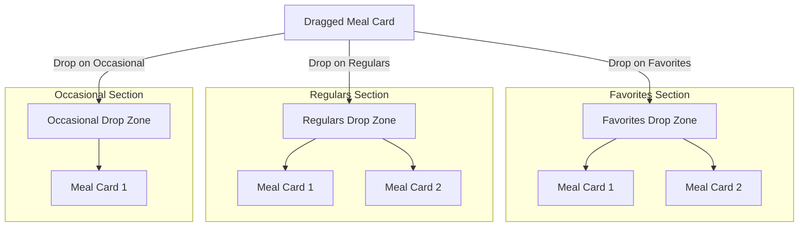
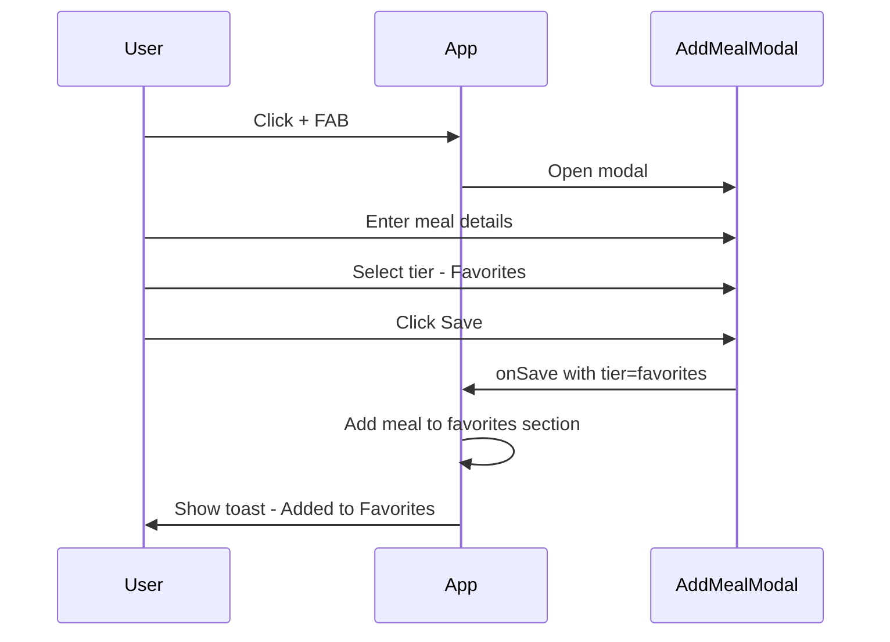
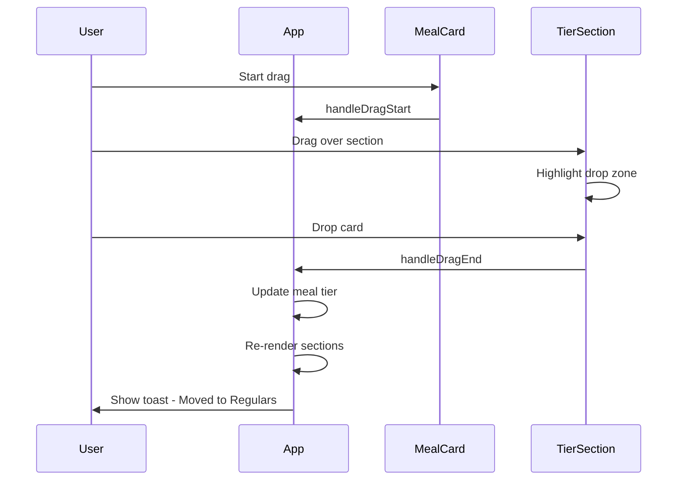

# Three-Tier Meal Categorization System Design

## Overview

This document outlines the design for implementing a user-controlled three-tier meal categorization system. The system replaces the current automatic tier calculation based on cooking frequency with manual user selection, making it easier for users to prioritize their commonly cooked meals.

---

## 1. Design Principles

### 1.1 Core Concept

The three-tier system helps users organize meals by how frequently they want to cook them:

| Tier | Name | Description | Use Case |
|------|------|-------------|----------|
| **Tier 1** | Favorites | Go-to meals cooked weekly | Quick access for weekly meal planning |
| **Tier 2** | Regulars | Meals cooked monthly | Good variety options |
| **Tier 3** | Occasional | Special or rare meals | Holiday meals, elaborate dishes, experiments |

### 1.2 Key Requirements

1. **User-Controlled**: Users manually assign meals to tiers, not based on cooking frequency
2. **Easy Reassignment**: Drag-and-drop between tier sections
3. **Clear Visual Hierarchy**: Moderate differentiation with subtle background colors
4. **Preserve Existing UI**: Keep the current meal card design and grid layout

---

## 2. Data Model Changes

### 2.1 Current Implementation

```typescript
// Current: Tier calculated from lastCooked timestamp
export type Tier = 'high' | 'medium' | 'low';

export interface Meal {
  id: string;
  lastCooked: number; // Timestamp used to calculate tier
  // ... other fields
}

// utils.ts - Automatic tier calculation
export const getTier = (lastCookedTimestamp: number): Tier => {
  const daysAgo = (Date.now() - lastCookedTimestamp) / DAY_MS;
  if (daysAgo <= 14) return 'high';
  if (daysAgo <= 60) return 'medium';
  return 'low';
};
```

### 2.2 Proposed Changes

```typescript
// Updated: Tier is user-selected, stored directly on meal
export type Tier = 'favorites' | 'regulars' | 'occasional';

export interface Meal {
  id: string;
  tier: Tier; // User-selected tier, defaults to 'regulars'
  lastCooked: number; // Keep for display purposes - shows when last cooked
  // ... other fields
}
```

### 2.3 Migration Strategy

For existing meals, migrate based on current `lastCooked` value:

```typescript
const migrateTier = (lastCooked: number): Tier => {
  const daysAgo = (Date.now() - lastCooked) / DAY_MS;
  if (daysAgo <= 14) return 'favorites';
  if (daysAgo <= 60) return 'regulars';
  return 'occasional';
};
```

---

## 3. UI Component Changes

### 3.1 Main Dashboard Layout

```
+----------------------------------------------------------+
|  [Minimal WeekTray - Collapsed by Default]                |
|  [M] [T] [W] [T] [F] [S] [S]  |  Week 3/7  [+]            |
+----------------------------------------------------------+
|  ⭐ Favorites                                    12 meals |
|  [Subtle warm background tone]                            |
|  +--------+  +--------+  +--------+  +--------+          |
|  |  Meal  |  |  Meal  |  |  Meal  |  |  Meal  |          |
|  +--------+  +--------+  +--------+  +--------+          |
+----------------------------------------------------------+
|  🔄 Regulars                                     24 meals |
|  [Neutral background tone]                                |
|  +--------+  +--------+  +--------+  +--------+          |
|  |  Meal  |  |  Meal  |  |  Meal  |  |  Meal  |          |
|  +--------+  +--------+  +--------+  +--------+          |
|  +--------+  +--------+  +--------+  +--------+          |
|  |  Meal  |  |  Meal  |  |  Meal  |  |  Meal  |          |
|  +--------+  +--------+  +--------+  +--------+          |
+----------------------------------------------------------+
|  ✨ Occasional                                    8 meals |
|  [Subtle cool background tone]                            |
|  +--------+  +--------+  +--------+  +--------+          |
|  |  Meal  |  |  Meal  |  |  Meal  |  |  Meal  |          |
|  +--------+  +--------+  +--------+  +--------+          |
+----------------------------------------------------------+
```

### 3.2 Section Header Design

```typescript
interface TierSectionProps {
  tier: Tier;
  meals: Meal[];
  onAddMeal: (meal: Meal) => void;
  onViewMeal: (meal: Meal) => void;
}

// Section styling per tier
const tierStyles = {
  favorites: {
    icon: '⭐',
    label: 'Favorites',
    bgClass: 'bg-amber-50/50 dark:bg-amber-950/20',
    borderClass: 'border-l-4 border-amber-400',
  },
  regulars: {
    icon: '🔄',
    label: 'Regulars',
    bgClass: 'bg-slate-50/50 dark:bg-slate-950/20',
    borderClass: 'border-l-4 border-slate-400',
  },
  occasional: {
    icon: '✨',
    label: 'Occasional',
    bgClass: 'bg-indigo-50/50 dark:bg-indigo-950/20',
    borderClass: 'border-l-4 border-indigo-400',
  },
};
```

### 3.3 Add/Edit Meal Modal - Tier Selection

Add a tier selector to the modal:

```
+------------------------------------------+
|  Add New Meal                         [X]|
+------------------------------------------+
|  Title: [________________________]       |
|                                          |
|  Tier:                                   |
|  +------------------------------------+  |
|  |  ⭐ Favorites    [○] Select        |  |
|  |     Weekly go-to meals             |  |
|  +------------------------------------+  |
|  |  🔄 Regulars      [●] Select       |  |
|  |     Monthly rotation meals         |  |
|  +------------------------------------+  |
|  |  ✨ Occasional    [○] Select       |  |
|  |     Special occasions, experiments |  |
|  +------------------------------------+  |
|                                          |
|  Effort: [Easy] [Medium] [Hard]          |
|  ... rest of form ...                    |
+------------------------------------------+
```

---

## 4. Drag-and-Drop Implementation

### 4.1 Drop Zone Architecture

Each tier section becomes a drop zone:



### 4.2 DnD Implementation Details

```typescript
// Using existing @dnd-kit/core

// Drop zone IDs
const TIER_DROP_ZONES = {
  favorites: 'tier-favorites',
  regulars: 'tier-regulars',
  occasional: 'tier-occasional',
} as const;

// Handle drag end
const handleDragEnd = (event: DragEndEvent) => {
  const { active, over } = event;
  
  if (over && activeMeal) {
    const overId = over.id.toString();
    
    // Check if dropped on a tier section
    if (overId.startsWith('tier-')) {
      const newTier = overId.replace('tier-', '') as Tier;
      updateMealTier(activeMeal.id, newTier);
    }
    
    // Check if dropped on a day slot (existing behavior)
    if (overId.startsWith('day-')) {
      const dayIndex = parseInt(overId.replace('day-', ''), 10);
      handleAddToTray(activeMeal, dayIndex);
    }
  }
};

// Update meal tier
const updateMealTier = (mealId: string, newTier: Tier) => {
  const updatedMeals = meals.map(meal => 
    meal.id === mealId ? { ...meal, tier: newTier } : meal
  );
  setMeals(updatedMeals);
  showToast(`Moved to ${newTier}`);
};
```

### 4.3 Visual Feedback During Drag

```typescript
// Highlight drop zone when dragging over
const TierSection: React.FC<TierSectionProps> = ({ tier, meals, ... }) => {
  const { isOver, setNodeRef } = useDroppable({
    id: `tier-${tier}`,
  });
  
  return (
    <section
      ref={setNodeRef}
      className={`
        ${tierStyles[tier].bgClass}
        ${isOver ? 'ring-2 ring-primary-500 ring-opacity-50' : ''}
        transition-all duration-200
      `}
    >
      {/* Section content */}
    </section>
  );
};
```

---

## 5. Visual Design Specifications

### 5.1 Color System for Tiers

```css
/* Light Mode */
--tier-favorites-bg: rgba(251, 191, 36, 0.1);   /* Amber tint */
--tier-favorites-border: #F59E0B;                /* Amber */
--tier-regulars-bg: rgba(100, 116, 139, 0.08);  /* Slate tint */
--tier-regulars-border: #64748B;                 /* Slate */
--tier-occasional-bg: rgba(99, 102, 241, 0.08); /* Indigo tint */
--tier-occasional-border: #6366F1;               /* Indigo */

/* Dark Mode */
--tier-favorites-bg: rgba(251, 191, 36, 0.08);
--tier-favorites-border: #FBBF24;
--tier-regulars-bg: rgba(148, 163, 184, 0.08);
--tier-regulars-border: #94A3B8;
--tier-occasional-bg: rgba(129, 140, 248, 0.08);
--tier-occasional-border: #818CF8;
```

### 5.2 Section Header Styling

```css
.tier-section {
  @apply rounded-2xl p-4 mb-6 transition-all duration-200;
}

.tier-section-header {
  @apply flex items-center justify-between mb-4;
}

.tier-section-title {
  @apply text-lg font-semibold text-primary flex items-center gap-2;
}

.tier-section-count {
  @apply text-sm text-secondary font-normal;
}

/* Tier-specific styles */
.tier-favorites {
  @apply bg-amber-50/50 dark:bg-amber-950/20;
  border-left: 4px solid theme('colors.amber.400');
}

.tier-regulars {
  @apply bg-slate-50/50 dark:bg-slate-950/20;
  border-left: 4px solid theme('colors.slate.400');
}

.tier-occasional {
  @apply bg-indigo-50/50 dark:bg-indigo-950/20;
  border-left: 4px solid theme('colors.indigo.400');
}
```

---

## 6. Implementation Checklist

### Phase 1: Data Model Updates
- [ ] Update `Tier` type in [`types.ts`](types.ts) to use new values
- [ ] Add `tier` field to `Meal` interface
- [ ] Update [`utils.ts`](utils.ts) - remove or repurpose `getTier()` function
- [ ] Create migration utility for existing meals
- [ ] Update [`hooks/useMeals.ts`](hooks/useMeals.ts) to handle tier updates

### Phase 2: UI Component Updates
- [ ] Create `TierSection` component for each tier
- [ ] Update [`App.tsx`](App.tsx) to render three tier sections
- [ ] Update [`AddMealModal.tsx`](components/AddMealModal.tsx) with tier selector
- [ ] Update [`MealDetailsModal.tsx`](components/MealDetailsModal.tsx) to show/edit tier
- [ ] Add tier indicator to [`MealCard.tsx`](components/MealCard.tsx) hover state

### Phase 3: Drag-and-Drop
- [ ] Add droppable zones to each tier section
- [ ] Update drag handlers to support tier reassignment
- [ ] Add visual feedback for drop zones
- [ ] Test drag from meal card to tier section
- [ ] Test drag from week tray to tier section

### Phase 4: Styling and Polish
- [ ] Add tier-specific background colors
- [ ] Style section headers with icons
- [ ] Add smooth animations for tier changes
- [ ] Test dark mode appearance
- [ ] Mobile responsiveness testing

### Phase 5: Data Migration
- [ ] Implement migration for existing users
- [ ] Test migration with various `lastCooked` values
- [ ] Ensure backward compatibility

---

## 7. User Flow Diagrams

### 7.1 Adding a New Meal



### 7.2 Reassigning Tier via Drag



---

## 8. Edge Cases and Considerations

### 8.1 Empty Tier Sections

When a tier has no meals, show an empty state:

```
+----------------------------------------------------------+
|  ⭐ Favorites                                     0 meals |
|  +----------------------------------------------------+  |
|  |                                                    |  |
|  |     Drag meals here or add new favorites          |  |
|  |                                                    |  |
|  +----------------------------------------------------+  |
+----------------------------------------------------------+
```

### 8.2 Search Results

When searching, show results across all tiers with tier indicator:

```
+----------------------------------------------------------+
|  Search: "chicken"                              5 results |
+----------------------------------------------------------+
|  ⭐ Chicken Stir Fry          [Favorites]                 |
|  🔄 Chicken Tacos             [Regulars]                  |
|  🔄 Chicken Curry             [Regulars]                  |
|  ✨ Chicken Cordon Bleu       [Occasional]                |
|  ✨ Chicken Kiev              [Occasional]                |
+----------------------------------------------------------+
```

### 8.3 Family Voting Mode

The tier should be visible but not editable during family voting. Meals can be voted on regardless of tier.

### 8.4 Shop List

Tier is not relevant for shop list view - focus on ingredients for selected week.

---

## 9. Future Enhancements

1. **Tier Statistics**: Show how many meals from each tier were cooked this month
2. **Smart Suggestions**: Suggest moving meals between tiers based on selection frequency
3. **Tier Limits**: Optional limits on tier sizes to encourage rotation
4. **Quick Tier Toggle**: Keyboard shortcut or swipe gesture to quickly change tier

---

## 10. Summary

This design transforms the meal categorization from an automatic, time-based system to a user-controlled, intentional organization method. The three tiers (Favorites, Regulars, Occasional) provide clear mental models for meal planning while the drag-and-drop interface makes reassignment intuitive.

Key benefits:
- **User Control**: Users decide meal priority, not the app
- **Visual Clarity**: Subtle color differentiation helps scan sections
- **Easy Reassignment**: Drag-and-drop between tiers
- **Preserved UX**: Keeps the existing meal card design and grid layout
