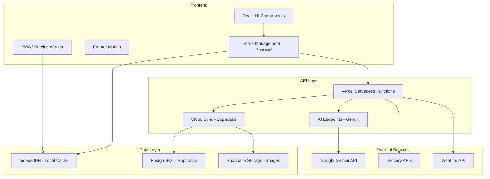

# The Rotation - Website Review & Improvement Plan

## Executive Summary

**The Rotation** is a smart meal planning application designed to help families organize weekly meals, generate recipes with AI, and sync across devices. This document provides a comprehensive review of the current implementation, identifies gaps between documentation requirements and actual implementation, and proposes innovative improvements to enhance the user experience and functionality.

---

## 1. Current Implementation Analysis

### 1.1 Core Features Implemented

| Feature | Status | Implementation Quality |
|---------|--------|----------------------|
| Weekly Meal Planning | ✅ Complete | Good - Week tray with day slots |
| AI Recipe Generation | ✅ Complete | Excellent - Multiple input methods |
| Photo Scan/Import | ✅ Complete | Good - Image parsing via Gemini |
| URL Import | ✅ Complete | Good - Google Search grounding |
| Thermomix Conversion | ✅ Complete | Excellent - Parallel method generation |
| AI Chef Chat | ✅ Complete | Good - Conversational interface |
| Cloud Sync | ✅ Complete | Good - Supabase integration |
| Shopping List | ✅ Complete | Good - Auto-generated from meals |
| Family Voting | ✅ Complete | Good - Gamified selection |
| Rotation Tiers | ✅ Complete | Good - Time-based categorization |
| Authentication | ✅ Complete | Good - Supabase Auth |
| Guest Mode | ✅ Complete | Good - Local storage fallback |

### 1.2 Technology Stack

- **Frontend**: React 18, Vite, TypeScript, Tailwind CSS
- **Backend**: Vercel Serverless Functions (Node.js)
- **AI**: Google Gemini API (gemini-3-flash-preview)
- **Database**: Supabase (PostgreSQL)
- **Storage**: IndexedDB with localStorage fallback
- **Deployment**: Vercel

---

## 2. Documentation vs Implementation Gap Analysis

### 2.1 Design Philosophy Gap

**Documented Requirements** ([`Docs/agents.md`](Docs/agents.md)):
- Apple/Nvidia/Tesla inspired premium aesthetics
- Glassmorphism navigation with `backdrop-blur-md`
- Bento-box style grids
- Framer Motion reveal-on-scroll animations
- Geist Sans or Inter typography with `-0.02em` tracking
- Subtle glowing borders for dark mode

**Current Implementation**:
- Standard Tailwind CSS styling
- Basic blur effects on navigation
- CSS-based animations (no Framer Motion)
- System default fonts
- Light mode only (no dark mode)

**Gap Severity**: **Medium** - The app is functional but lacks the premium aesthetic described in the design documents.

### 2.2 Missing Features from Documentation

**From [`README.md`](README.md)**:
- ❌ **Drag and drop meals** - Mentioned but not implemented (meals are clicked to add)
- ⚠️ **Photo Scan** - Works but could use better camera integration

**From [`Docs/implementation_plan.md`](Docs/implementation_plan.md)**:
- The implementation plan is mostly a template with unfilled placeholders
- No clear project concept defined
- Phase tracking incomplete

### 2.3 Frontend Design Skill Requirements

**From [`Docs/frontend_design_skill.md`](Docs/frontend_design_skill.md)**:
- Distinctive typography (avoid Inter, Roboto, Arial)
- Bold aesthetic direction
- High-impact motion design
- Unexpected layouts with asymmetry
- Context-specific character

**Current State**:
- Uses generic styling without distinctive character
- Standard grid layouts
- Minimal animation
- No unique visual identity

---

## 3. Identified Improvement Opportunities

### 3.1 Critical Improvements (High Priority)

#### 3.1.1 Visual Design Overhaul

**Problem**: The current design is functional but lacks the premium, distinctive aesthetic outlined in the documentation.

**Solution**: Implement a comprehensive design system:

```
Design System Components:
├── Typography
│   ├── Display Font: Playfair Display or Fraunces (editorial feel)
│   ├── Body Font: DM Sans or Outfit (modern, readable)
│   └── Mono: JetBrains Mono (for measurements)
├── Color Palette
│   ├── Primary: Warm terracotta (#C45C26) - appetizing, warm
│   ├── Secondary: Sage green (#6B8E6B) - fresh, healthy
│   ├── Accent: Golden amber (#F5A623) - highlights
│   └── Neutrals: Warm grays with slight brown undertone
├── Effects
│   ├── Glassmorphism with warm tint
│   ├── Subtle paper texture backgrounds
│   ├── Soft shadows with warm tones
│   └── Smooth spring animations
└── Components
    ├── Recipe cards with ingredient preview
    ├── Meal timeline visualization
    └── Interactive week planner
```

#### 3.1.2 Drag and Drop Implementation

**Problem**: The README promises drag-and-drop functionality, but meals are currently added via click selection.

**Solution**: Implement drag-and-drop using `@dnd-kit/core`:

```typescript
// Proposed Implementation
import { DndContext, useDraggable, useDroppable } from '@dnd-kit/core';

// DraggableMealCard - Meals can be dragged from tier rows
// DroppableDaySlot - Days accept dropped meals
// Visual feedback during drag with smooth animations
```

**Benefits**:
- More intuitive meal planning
- Faster week organization
- Better mobile experience with touch support

#### 3.1.3 Dark Mode Implementation

**Problem**: No dark mode exists despite documentation mentioning "premium dark modes" and "edge lighting."

**Solution**: Implement theme system with CSS variables:

```typescript
// Theme configuration
const themes = {
  light: {
    bg: 'warm-white',
    surface: 'white',
    text: 'slate-900',
    accent: 'terracotta-600'
  },
  dark: {
    bg: 'slate-950',
    surface: 'slate-900',
    text: 'slate-100',
    accent: 'terracotta-400',
    glow: 'subtle edge lighting on cards'
  }
};
```

### 3.2 Feature Enhancements (Medium Priority)

#### 3.2.1 Smart Meal Suggestions

**Concept**: AI-powered meal recommendations based on:
- Past cooking history
- Seasonal availability
- Weather conditions
- Family preferences
- Dietary restrictions

**Implementation**:
```typescript
interface MealSuggestion {
  meal: Meal;
  reason: string; // "Perfect for rainy days" / "In season now"
  confidence: number;
}

// API endpoint: /api/ai/suggest-meals
// Context: weather, season, history, preferences
```

#### 3.2.2 Nutritional Information Integration

**Concept**: Automatic nutritional analysis for recipes:

```typescript
interface NutritionInfo {
  calories: number;
  protein: number;
  carbs: number;
  fat: number;
  fiber: number;
  servings: number;
}

// Extend Meal type with nutrition field
// Calculate from ingredients using AI
// Display in meal details modal
```

#### 3.2.3 Meal Prep Timeline

**Concept**: Visual timeline showing when to start cooking each meal:

```
Week View with Time Estimates:
┌─────────────────────────────────────────────┐
│ Monday                                      │
│ ├── 5:30 PM - Start prep (15 min)          │
│ ├── 5:45 PM - Cook Taco Tuesday (20 min)   │
│ └── 6:05 PM - Ready to serve               │
└─────────────────────────────────────────────┘
```

#### 3.2.4 Recipe Scaling

**Concept**: Adjust ingredient quantities based on servings:

```typescript
interface ScaledRecipe {
  originalServings: number;
  targetServings: number;
  scaledIngredients: string[];
}

// Slider in meal details to adjust servings
// AI-powered intelligent scaling for tricky ingredients
```

#### 3.2.5 Leftovers Management

**Concept**: Track and suggest uses for leftovers:

```typescript
interface LeftoverItem {
  meal: string;
  remaining: string; // "2 portions"
  bestBy: Date;
  suggestedUses: string[];
}

// Notification when leftovers should be used
// Recipe suggestions incorporating leftovers
```

### 3.3 Innovative Features (Future Roadmap)

#### 3.3.1 Smart Grocery Integration

**Concept**: Connect with grocery delivery services:

- **Ingredient Consolidation**: Combine same ingredients across meals
- **Price Optimization**: Suggest budget-friendly alternatives
- **Availability Check**: Warn about out-of-season items
- **One-Click Order**: Export to Instacart/Woolworths/Coles APIs

```
Shopping Flow:
1. Generate list from week plan
2. Consolidate duplicates (2 onions + 1 onion = 3 onions)
3. Check store availability
4. Compare prices across stores
5. Export to preferred grocery service
```

#### 3.3.2 Social Features

**Concept**: Share and discover within family/friend groups:

```typescript
interface FamilyGroup {
  id: string;
  members: User[];
  sharedMeals: Meal[];
  mealPlans: WeekPlan[];
  events: MealEvent[]; // "Sunday Roast at Grandma's"
}

// Features:
// - Share recipes with family
// - Collaborative meal planning
// - Event coordination
// - Recipe comments and ratings
```

#### 3.3.3 Cooking Mode

**Concept**: Hands-free cooking assistance:

```
Cooking Mode Features:
├── Step-by-step voice guidance
├── Timer integration per step
├── Voice commands ("Next step", "Repeat", "Timer")
├── Keep screen awake
├── Thermomix integration with machine sync
└── Photo progress capture
```

#### 3.3.4 Meal History & Analytics

**Concept**: Track cooking patterns and insights:

```typescript
interface CookingStats {
  mealsCooked: number;
  favoriteProteins: { protein: string; count: number }[];
  cuisineDistribution: { cuisine: string; percentage: number }[];
  cookingFrequency: { day: string; meals: number }[];
  averageEffort: number;
  seasonalPatterns: string[];
}

// Dashboard with charts and insights
// "You cooked Italian 40% of the time this month"
// "Taco Tuesday is your most consistent meal"
```

#### 3.3.5 Pantry Inventory

**Concept**: Track what you have and suggest meals:

```typescript
interface PantryItem {
  ingredient: string;
  quantity: string;
  expiryDate?: Date;
  location: 'pantry' | 'fridge' | 'freezer';
}

// Features:
// - Scan receipt to add items
// - Barcode scanning
// - Expiry notifications
// - "Cook from pantry" suggestions
// - Auto-remove from inventory when cooked
```

---

## 4. Technical Improvements

### 4.1 Performance Optimizations

| Area | Current | Proposed |
|------|---------|----------|
| Image Handling | Base64 in storage | CDN with compression |
| State Management | useState + useEffect | Zustand or Jotai |
| Animation | CSS transitions | Framer Motion |
| Offline Support | Basic localStorage | Service Worker + PWA |
| Bundle Size | Standard Vite | Route-based code splitting |

### 4.2 Code Quality Improvements

```typescript
// 1. Implement proper error boundaries
class MealErrorBoundary extends React.Component {
  // Graceful error handling for meal operations
}

// 2. Add comprehensive TypeScript types
interface MealPlanState {
  meals: MealMap;
  weekSlots: WeekSlotsMap;
  // ... with proper typing
}

// 3. Implement proper testing
// - Unit tests for utilities
// - Integration tests for hooks
// - E2E tests for critical flows
```

### 4.3 Accessibility Improvements

- Add ARIA labels to all interactive elements
- Implement keyboard navigation for meal selection
- Add screen reader announcements for dynamic content
- Ensure color contrast meets WCAG 2.1 AA standards
- Add focus indicators for all interactive elements

---

## 5. User Experience Improvements

### 5.1 Onboarding Flow

```
Welcome Flow:
┌─────────────────────────────────────────────┐
│ Step 1: Who's cooking?                      │
│ ├── Add family members                      │
│ └── Set dietary preferences                 │
│                                             │
│ Step 2: What do you have?                   │
│ ├── Import from URL                         │
│ ├── Scan a recipe                           │
│ └── Start with examples                     │
│                                             │
│ Step 3: Plan your first week                │
│ ├── Drag meals to days                      │
│ └── Generate shopping list                  │
└─────────────────────────────────────────────┘
```

### 5.2 Improved Search

```typescript
interface SearchFilters {
  protein: string[];
  effort: Effort[];
  tags: string[];
  cuisine: string[];
  maxTime: number;
  dietary: ('vegetarian' | 'vegan' | 'gluten-free')[];
}

// Faceted search with filters
// Fuzzy matching for typos
// Recent searches
// Saved search presets
```

### 5.3 Mobile Experience

- Bottom navigation for easy thumb access
- Swipe gestures for meal actions
- Pull-to-refresh for sync
- Haptic feedback for interactions
- Widget for today's meals

---

## 6. Implementation Roadmap

### Phase 1: Foundation (Weeks 1-2)
- [ ] Implement design system with CSS variables
- [ ] Add dark mode support
- [ ] Install and configure Framer Motion
- [ ] Add proper typography (Google Fonts)
- [ ] Implement drag-and-drop for meals

### Phase 2: Core Enhancements (Weeks 3-4)
- [ ] Add nutritional information to recipes
- [ ] Implement recipe scaling
- [ ] Add meal prep timeline
- [ ] Improve search with filters
- [ ] Add onboarding flow

### Phase 3: Smart Features (Weeks 5-6)
- [ ] Implement meal suggestions
- [ ] Add leftovers management
- [ ] Create cooking mode
- [ ] Add meal history tracking
- [ ] Implement pantry inventory

### Phase 4: Integration & Polish (Weeks 7-8)
- [ ] Add grocery service integrations
- [ ] Implement social features
- [ ] Add analytics dashboard
- [ ] Performance optimization
- [ ] Comprehensive testing

---

## 7. Architecture Diagram



---

## 8. Key Metrics to Track

| Metric | Current Baseline | Target |
|--------|-----------------|--------|
| Time to plan a week | ~5 minutes | <2 minutes |
| Recipe import success rate | Unknown | >95% |
| User retention (7-day) | Unknown | >40% |
| Meals cooked per week | Unknown | 5+ |
| Shopping list usage | Unknown | >80% |

---

## 9. Conclusion

The Rotation has a solid foundation with innovative AI features that differentiate it from other meal planning apps. However, there are significant opportunities to enhance the user experience through:

1. **Visual Design**: Implementing the premium aesthetic described in the documentation
2. **Interaction**: Adding drag-and-drop and improving mobile experience
3. **Intelligence**: Expanding AI capabilities with suggestions and analytics
4. **Integration**: Connecting with grocery services and smart kitchen devices
5. **Social**: Enabling family collaboration and recipe sharing

By implementing these improvements in phases, The Rotation can become the definitive meal planning solution for modern families.

---

## Appendix: File References

- Main Application: [`App.tsx`](App.tsx)
- Type Definitions: [`types.ts`](types.ts)
- AI Integration: [`ai.ts`](ai.ts)
- State Management: [`hooks/useMeals.ts`](hooks/useMeals.ts), [`hooks/useCloudSync.ts`](hooks/useCloudSync.ts)
- Components:
  - [`components/LandingPage.tsx`](components/LandingPage.tsx)
  - [`components/AddMealModal.tsx`](components/AddMealModal.tsx)
  - [`components/AIChefChat.tsx`](components/AIChefChat.tsx)
  - [`components/FamilyVoting.tsx`](components/FamilyVoting.tsx)
  - [`components/WeekTray.tsx`](components/WeekTray.tsx)
  - [`components/ShopList.tsx`](components/ShopList.tsx)
- API Routes: [`api/ai/`](api/ai/)
- Documentation: [`Docs/`](Docs/)
